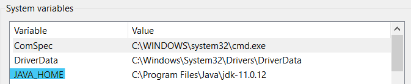

Read Password Protected Excel Files
================

# Problem

With GDPR / POPIA etc. as data people we often have sensitive
information in Excel files. We also need to work with data that contains
sensitive information even if the data we’re interested in is generic
(i.e. we don’t really care about the email address of an individual, but
we may be interested in their order specifics or their gender).

We can encrypt the file and not have it lying around on our PC
un-encrypted by password protecting it.

We then want to work with the encrypted file directly in R instead of
un-encrypting and putting the file contents at risk.

This small code snippet will show you how to do that.

## Setup

1.  You will need the [{XLConnect}
    Package](https://cran.r-project.org/web/packages/XLConnect/index.html)
    📦.

    ``` r
    install.packages("XLConnect")
    ```

2.  The package uses Java. You will need a Java version between 8
    and 17. I have Java SE Development version `11.0.12` (64-bit) on my
    Windows machine.

3.  You need to set your `JAVA_HOME` environment variable.

-   To set your environment variables, I find it easiest to search in my
    windows search box for `environment variables`.

-   The search yields a `Edit the system environment variables` option.

-   Clicking on that opens the `System Properties` pop-up window.

-   In the pop-up window click the `Environment Variables` button on the
    lower right hand corner.

-   Set `JAVA_HOME` if it has not been setup already. It should be of
    the form `C:\Program Files\Java\jdk-XXX`.

    <figure>

    

    <figcaption>

    Set your JAVA\_HOME environment variable

    </figcaption>
    </figure>

#### Note: for a big file there may be some options you need to set - for example I needed the following to read two files that were \~9Mb in size.

`options(java.parameters = "-Xmx4g")`

``` r
# options(java.parameters = "-Xmx4g")

# Load the workbook
mock_pii_wb <- loadWorkbook("MOCK_DATA.xlsx", password = "imi$$@irp0rt$")

# Read the worksheet, and make it a tibble
mock_pii_data <- readWorksheet(mock_pii_wb, "sheet1") %>% as_tibble()

mock_pii_data %>% 
  count(gender, sort = TRUE)
#> # A tibble: 8 x 2
#>   gender          n
#>   <chr>       <int>
#> 1 Agender       151
#> 2 Genderqueer   130
#> 3 Female        127
#> 4 Polygender    124
#> 5 Non-binary    120
#> 6 Male          118
#> 7 Genderfluid   117
#> 8 Bigender      113
```
